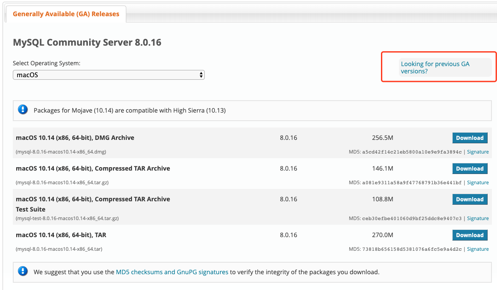
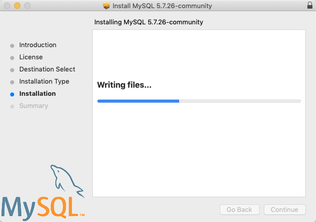
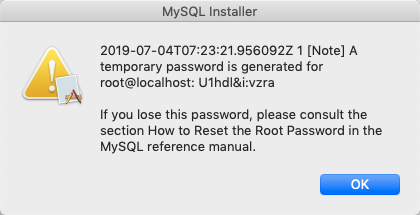

# mybatis自动创建mapper

## jdbc

### ~~jdbc 安装~~

~~下载jdbc， mac版本[链接](https://dev.mysql.com/downloads/mysql/)~~

~~~~

~~Note: 注意版本信息  
如果版本不对，需要选在**Looking for previous GA version?**~~

* 查看版本信息

```sql
mysql> select version();
+-------------------------+
| version()               |
+-------------------------+
| 5.7.26-0ubuntu0.16.04.1 |
+-------------------------+
1 row in set (0.00 sec)
```

jdbc安装过程


jdbc安装完成 现实passwd



----

### pom.xml

在pom.xml文件中倒入mysql的相关包即可

```xml
<!-- https://mvnrepository.com/artifact/mysql/mysql-connector-java -->
<dependency>
    <groupId>mysql</groupId>
    <artifactId>mysql-connector-java</artifactId>
    <version>8.0.16</version>
</dependency>

```
