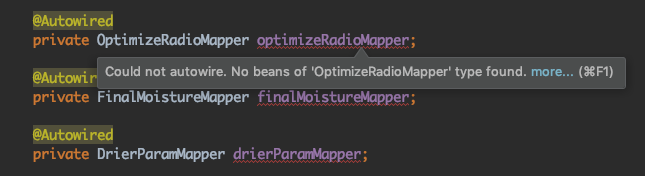

# sprintboot

## 配置文件

* yml

需要空格来缩进

* proprieties

使用key-value的模式

## 常用注解

* Autowired

方法1：在mapper文件上加@Repository注解，这是从spring2.0新增的一个注解，用于简化 Spring 的开发，实现数据访问

方法2：在mapper文件上加@Component注解，把普通pojo实例化到spring容器中，相当于配置文件中的<bean id="" class=""/>
